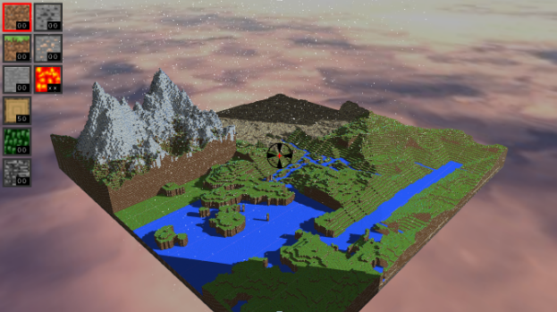
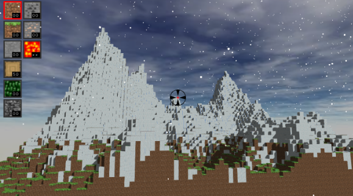
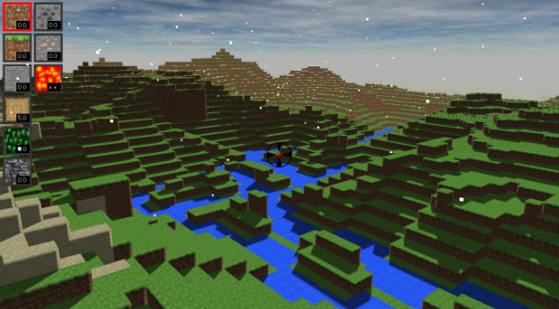
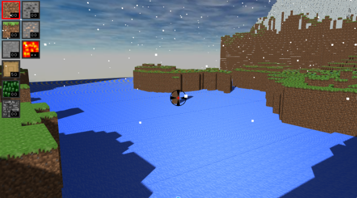
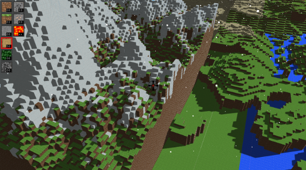
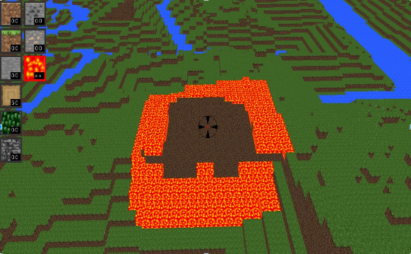
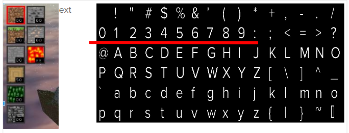

## Minecraft
This is a group project implemented by Kaixiang Miu, Jiawei Wang and me.The program is implemented on the platform of QT creator. Here is the description for the game.

## ScreenShot
  

## Features     
In this minecraft game, the main features include:     
* Perlin Noise topography    
* Weather billboard    
* Sky box    
* River system    
* texture, normal map and shadow map    
* Day and night cycling    
* Collision Detection    
* Simple Forest Fire    
* Player GUI   
* Fetch and place operation.    
     
Screen shoots for different features:     
Overview:       
     
       
Frigid Mountains:     
     
        
River System:        
       
       
Lake:      
   
        
Shadow_map:     
      
        
Lava_Spread:      
   
         
GUI:      
       

       